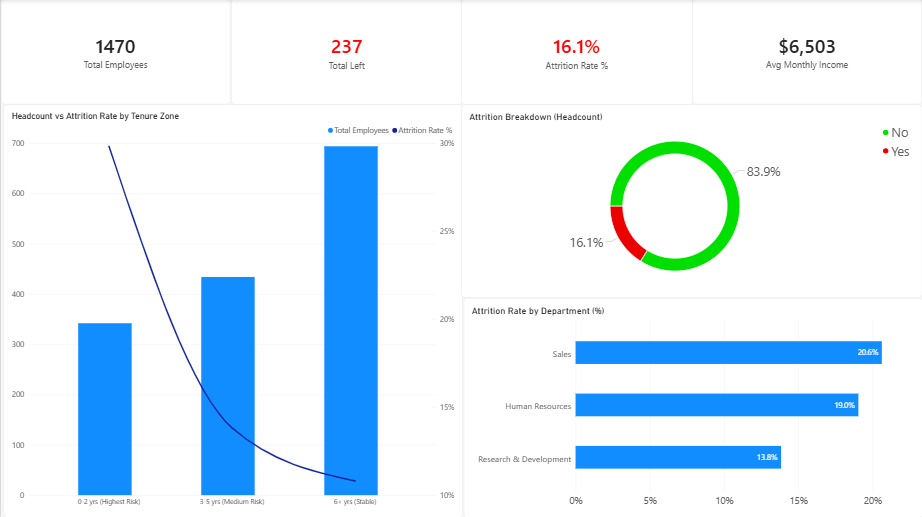
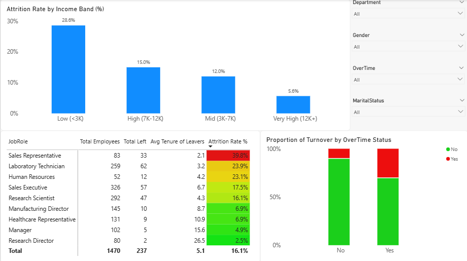
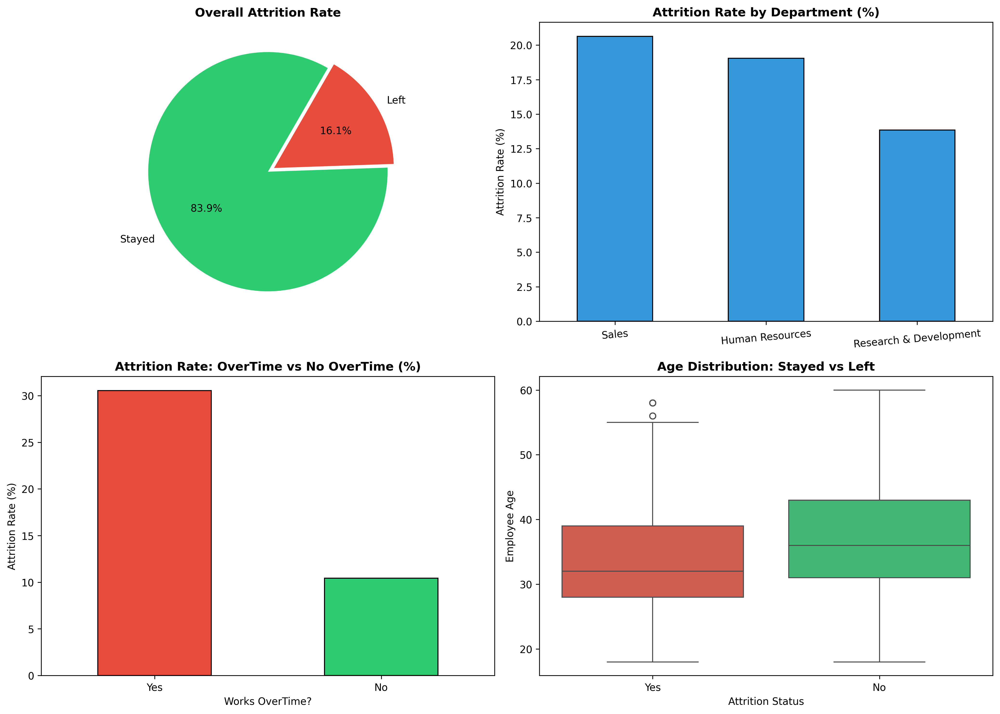
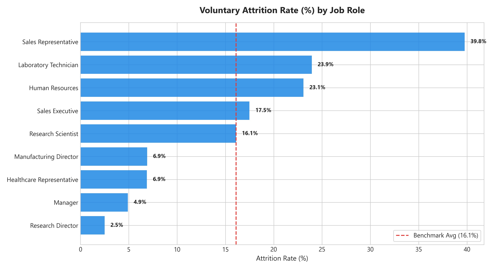
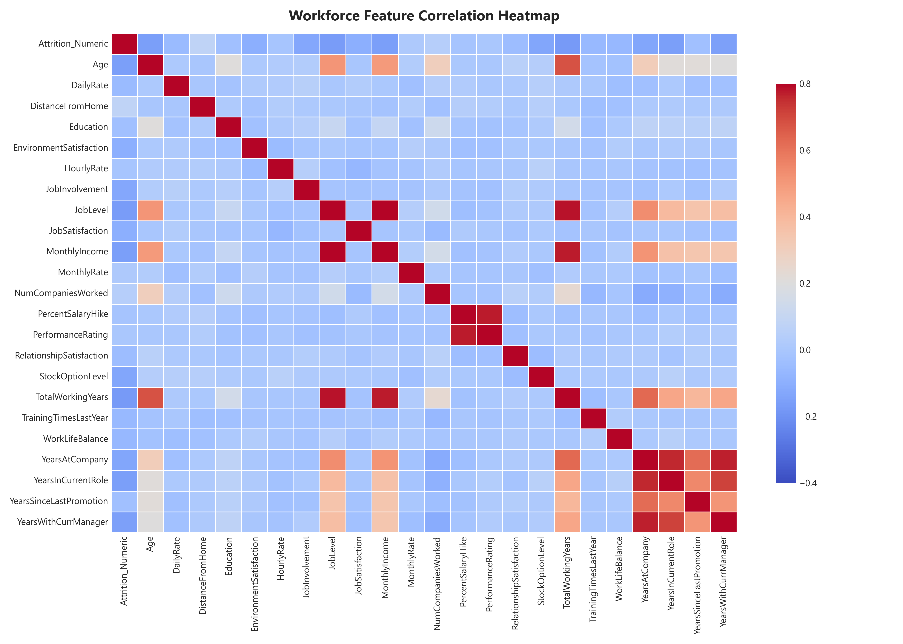
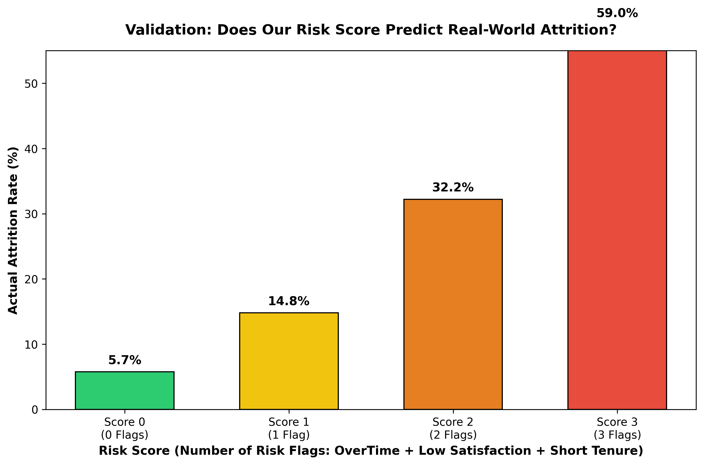
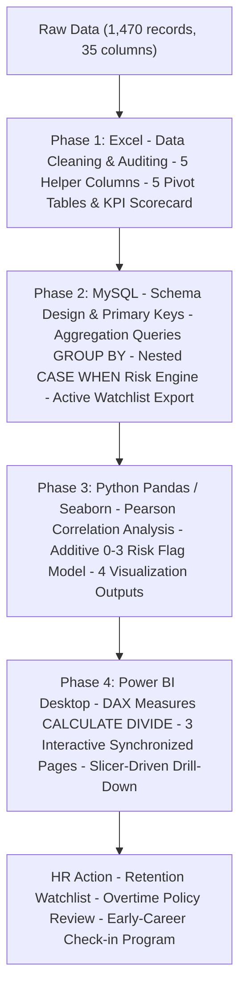

# 🏢 HR Attrition & Workforce Intelligence

[](https://github.com/rohan912-456)
[](python/requirements.txt)
[](sql/)
[](LICENSE)

> **An enterprise-grade People Analytics case study analyzing 1,470 employee records across 35 attributes. Combines exploratory data analysis, relational SQL modeling, statistical correlation in Python, and an interactive 3-page Power BI dashboard to diagnose voluntary turnover drivers and operationalize a proactive retention watch-list.**

I built an end-to-end People Analytics and Workforce Intelligence project analyzing 1,470 employee records across 35 features to identify voluntary attrition drivers and engineer a proactive retention system.

I began in Excel conducting data quality audits and pivot cross-tabulations, uncovering that overtime workers experienced nearly 3x higher turnover.

I then translated that logic into SQL (MySQL/phpMyAdmin) using GROUP BY, HAVING, and nested CASE WHEN expressions to build a rule-based risk model that showed a 5x turnover disparity between High and Low-Risk segments.

In Python, I performed exploratory statistical analysis with Pandas, Seaborn, and Matplotlib, computing a full Pearson correlation matrix and constructing a transparent 0-to-3 point Risk Score that was validated against real attrition outcomes (climbing from 5.7% up to 59.0%).

Finally, I synthesized everything into a 3-page interactive Power BI dashboard using DAX measures like CALCULATE and DIVIDE, delivering an executive summary, a granular role deep-dive, and an actionable watch-list of active at-risk employees for HR business partners.

---

## 📌 Executive Summary

Employee turnover poses severe organizational costs, productivity losses, and talent acquisition strain. This project investigates voluntary attrition patterns across a 1,470-person workforce to answer three critical business questions:
1. **Who is leaving?** (Identifying demographic, tenure, and departmental clusters most prone to departure).
2. **Why are they leaving?** (Pinpointing actionable operational triggers: overtime demands, compensation equity, and satisfaction levels).
3. **Who is at risk next?** (Building explainable risk-scoring models that provide HR business partners with a pre-emptive retention watchlist before resignation letters land).

By implementing a multi-stage analytics pipeline across **Excel → MySQL → Python → Power BI**, this project delivers both executive-level strategic visibility and individual-level tactical interventions.

---

## 🎯 Key Business Findings (The "TL;DR")

* **Baseline Turnover Benchmark:** Company-wide attrition stands at **16.1%** (237 departures out of 1,470 employees).
* **The Overtime Penalty (~3x Multiplier):** Employees subjected to mandatory overtime experience **30.5% attrition**, compared to only **10.4%** for non-overtime peers. Overtime is the single strongest operational catalyst for voluntary turnover.
* **Early-Tenure Vulnerability Window:** Turnover risk is heavily front-loaded in the **first 0 to 2 years at the company (~30% attrition)**, declining sharply to **~17%** for mid-tenure (3–5 years) and **~11%** for tenured staff (6+ years).
* **Severe Pay Discrepancy ($2,046 Gap):** Departing employees earn an average of **$4,787/month** versus **$6,833/month** for retained staff—representing a **~30% compensation shortfall** across comparable job levels.
* **Role-Specific Vulnerability:** **Sales Representatives (39.8%)** and **Laboratory Technicians (23.9%)** exhibit critical flight rates driven by the compound effect of low entry pay and high workload friction.
* **Predictive Risk Model Validation:** 
  * The SQL Rule-Based Model identifies a **High-Risk cohort departing at 36.6%** (~4.3x the Low-Risk baseline of 8.5%).
  * The Python 0–3 Flag Model scales monotonically from **5.7% (0 flags)** up to **59.0% (3 flags)**.
* **Active Retention Watch-List:** **153 currently active employees** meet high-risk threshold conditions requiring immediate, proactive HR engagement.

---

## 📊 Interactive Dashboard Walkthrough (Power BI)

The project includes an interactive 3-page Power BI report (`power_bi/HR_Attrition_Visualization.pbix`) with DAX measures, color-coded risk semantics (Green = Retained / Red = Leaver), and cross-filtering slicers.

### Page 1: Executive Overview


* **Purpose:** Top-line workforce health metrics for leadership.
* **What's in it:**
  * KPI Cards — Total Headcount (1,470), Total Leavers (237), Turnover Rate (16.1%), Avg Monthly Income ($6,503)
  * Headcount vs. Attrition Rate by tenure — shows the spike in first 0–2 years
  * Attrition Donut Chart — 83.9% active vs. 16.1% departed
  * Department Attrition Bar Chart — Sales (20.6%), HR (19.0%), R&D (13.8%)

---

### Page 2: Deep Dive — Who Is Leaving?


* **Purpose:** Helps HR Business Partners pinpoint exact intersections of pay, role, and overtime exposure.
* **What's in it:**
  * Income Band Attrition — Low income (<$3K) has 28.6% turnover; very high earners ($12K+) only 5.6%
  * Role-Based Attrition Matrix — Sales Reps at 39.8%, Lab Technicians at 23.9%
  * 100% Stacked OverTime Chart — visually shows the overtime-exposed departure volume
  * Slicers by Department, Gender, OverTime, Marital Status

---

### Page 3: Risk Segmentation & Actionable Watch-List


* **Purpose:** Turns the analysis into a live HR action list.
* **What's in it:**
  * Active High-Risk Gauge — **153 currently active employees** flagged (OverTime = Yes + JobSatisfaction ≤ 2)
  * 0–3 Flag Model Chart — 5.74% → 14.79% → 32.21% → 58.97% (proves the model works)
  * Rule-Based Segmentation — High Risk (36.6%), Medium Risk (18.7%), Low Risk (8.5%)
  * Watch-List Table — Employee Number, Department, Role, Age, Income, Tenure, Risk Drivers

---

## 🔬 Python Analysis & Visualizations

The Jupyter Notebook ([`python/HR_Attrition_Employee_Data_Analyst_Project.ipynb`](python/HR_Attrition_Employee_Data_Analyst_Project.ipynb)) handles full data cleaning, Pearson correlation matrix, and 0–3 flag risk score validation.

| 01. Turnover vs. Tenure & Income | 02. Role-Level Attrition Rates |
| :---: | :---: |
|  |  |
| *Leavers cluster in low-salary, low-tenure range.* | *Sales Reps & Lab Techs exceed the 16.1% company average.* |

| 03. Pearson Correlation Heatmap | 04. Risk Score Validation Curve |
| :---: | :---: |
|  |  |
| *24 numeric features evaluated against attrition.* | *Score climbs monotonically — confirms predictive power.* |

---

## 🛠️ Project Architecture & Analytics Lifecycle



### Phase 1: Excel
* **Data Auditing:** Verified zero missing values across all 35 columns using `COUNTBLANK`; confirmed `EmployeeNumber` uniqueness.
* **5 Helper Columns Created:**
  * `Attrition_Flag`: `=IF(H2="Yes", 1, 0)`
  * `Age_Group`: Bucketized into `<30`, `30–39`, `40–49`, `50+`
  * `Tenure_Group`: `0–2 yrs (High Risk)`, `3–5 yrs`, `6+ yrs`
  * `Income_Band`: `<3K (Low)`, `3K–7K (Mid)`, `7K–12K (High)`, `12K+ (Very High)`
  * `High_Risk_Flag`: Multi-condition flag (overtime + low satisfaction)
* **Output:** 5 pivot tables + executive KPI scorecard

### Phase 2: SQL / MySQL
* **Schema ([`01_schema_setup.sql`](sql/01_schema_setup.sql)):** Strict data typing, `PRIMARY KEY (EmployeeNumber)`, analytical indexes on `Attrition`, `Department`, `JobRole`, `OverTime`.
* **Analytical Queries ([`02_analytical_queries.sql`](sql/02_analytical_queries.sql)):** Attrition rates by department, role, overtime exposure, and income band.
* **Risk Engine ([`03_risk_segmentation_watchlist.sql`](sql/03_risk_segmentation_watchlist.sql)):**

```sql
SELECT 
    CASE 
        WHEN OverTime = 'Yes' AND JobSatisfaction <= 2 THEN 'High Risk'
        WHEN OverTime = 'Yes' OR JobSatisfaction <= 2 THEN 'Medium Risk'
        ELSE 'Low Risk'
    END AS Risk_Segment,
    COUNT(*) AS Employee_Count,
    SUM(CASE WHEN Attrition = 'Yes' THEN 1 ELSE 0 END) AS Actually_Left,
    ROUND(SUM(CASE WHEN Attrition = 'Yes' THEN 1.0 ELSE 0.0 END) / COUNT(*) * 100, 2) AS Attrition_Rate_Percent
FROM employees
GROUP BY Risk_Segment;
```

### Phase 3: Python
* Notebook: [`python/HR_Attrition_Employee_Data_Analyst_Project.ipynb`](python/HR_Attrition_Employee_Data_Analyst_Project.ipynb)
* Full Pearson correlation matrix across 24 numeric features
* Risk Score = OverTime flag + Low JobSatisfaction flag + Low Tenure flag (0–3 points)
* Validated: Score 0 → 5.7% | Score 1 → 14.8% | Score 2 → 32.2% | Score 3 → 59.0%

### Phase 4: Power BI

```
Attrition Rate % = DIVIDE(CALCULATE(COUNTROWS('employees'), 'employees'[Attrition] = "Yes"), COUNTROWS('employees'), 0)

Active Employees = CALCULATE(COUNTROWS('employees'), 'employees'[Attrition] = "No")
```

* Dynamic color conditioning, synchronized slicers, and custom tooltips across 3 pages.

---

## 💡 Strategic Recommendations for HR Leadership

| Strategic Pillar | Identified Root Cause | Proposed HR Intervention | Expected Business ROI |
| :--- | :--- | :--- | :--- |
| **1. Overtime Cap Policy** | Overtime staff leave at 30.5% (~3x normal rate). | Establish mandatory quarterly caps on consecutive overtime hours; implement flex-time recovery days and workload rebalancing. | Projected **15–20% reduction** in overtime-driven turnover, saving ~$350K+ in re-hiring costs. |
| **2. Early-Tenure Onboarding (0–2 Yrs)** | High turnover spike within the first 24 months (~30%). | Introduce a structured 30-60-90 day check-in schedule, assigned senior peer mentors, and 6-month career roadmap alignment. | Accelerate time-to-productivity and reduce first-year attrition by an estimated **8–12%**. |
| **3. Compensation Equity Audits** | Leavers earn an average of $2,046 less per month across identical job tiers. | Conduct bi-annual market salary benchmarks for bottom-quartile earners (<$3,000/mo), specifically in Sales and Lab roles. | Closes the wage gap for high-performing flight risks before they test the external market. |
| **4. Watch-List Intervention Protocol** | 153 active employees identified in the high-risk flight zone. | HR Business Partners conduct proactive, confidential "Stay Interviews" focusing on workload, growth, and team friction. | Retains critical institutional knowledge and preempts sudden operational disruptions. |

---

## 📁 Repository Directory Structure

```
HR-Attrition-Workforce-Intelligence/
|
|-- README.md
|-- LICENSE
|-- .gitignore
|
|-- assets/
|   |-- dashboards/
|   |   |-- page1_executive_overview.png
|   |   |-- page2_deep_dive.png
|   |   `-- page3_risk_watchlist.png
|   `-- python_visuals/
|       |-- 01_attrition_overview.png
|       |-- 02_jobrole_satisfaction.png
|       |-- 03_correlation_heatmap.png
|       `-- 04_risk_score_validation.png
|
|-- data/
|   |-- raw/
|   |   `-- HR-Employee-Attrition.csv         (original dataset, 1,470 records, 35 columns)
|   `-- processed/
|       |-- dept_attrition.csv
|       |-- dept_attrition_python.csv
|       |-- dept_gender_attrition.csv
|       |-- hr_data_with_risk_score.csv
|       |-- income_comparison.csv
|       |-- jobrole_attrition.csv
|       |-- overtime_attrition.csv
|       |-- risk_score_validation.csv
|       |-- risk_segments.csv
|       |-- watchlist_employees.csv
|       `-- watchlist_from_python.csv
|
|-- excel/
|   `-- HR_Attrition_Analysis.xlsx            (Excel workbook with helper columns & pivot tables)
|
|-- sql/
|   |-- 01_schema_setup.sql                   (database & table creation)
|   |-- 02_analytical_queries.sql             (core attrition queries)
|   `-- 03_risk_segmentation_watchlist.sql    (CASE WHEN risk engine + watchlist)
|
|-- python/
|   |-- HR_Attrition_Employee_Data_Analyst_Project.ipynb
|   `-- requirements.txt
|
`-- power_bi/
    `-- HR_Attrition_Visualization.pbix       (3-page interactive Power BI dashboard)
```

---

## 🚀 How to Run & Reproduce

### 1. Clone the Repository
```bash
git clone https://github.com/rohan912-456/HR-Attrition-Workforce-Intelligence.git
cd HR-Attrition-Workforce-Intelligence
```

### 2. Set Up MySQL Database
```bash
mysql -u root -p < sql/01_schema_setup.sql
mysql -u root -p < sql/02_analytical_queries.sql
mysql -u root -p < sql/03_risk_segmentation_watchlist.sql
```

### 3. Run the Python Notebook
```bash
pip install -r python/requirements.txt
jupyter notebook python/HR_Attrition_Employee_Data_Analyst_Project.ipynb
```

### 4. Open the Power BI Dashboard
* Open `power_bi/HR_Attrition_Visualization.pbix` in [Power BI Desktop](https://powerbi.microsoft.com/).
* Dataset is embedded — no reconnection needed. Interact with slicers across all 3 pages.

---

## 👤 Author & Contact

**Rohan Nandanwar**
*Data Analyst*

* **LinkedIn:** [linkedin.com/in/rohan4560](https://www.linkedin.com/in/rohan4560/)
* **GitHub:** [github.com/rohan912-456](https://github.com/rohan912-456)
* **Email:** [rohnandanwar456@gmail.com](mailto:rohnandanwar456@gmail.com)
