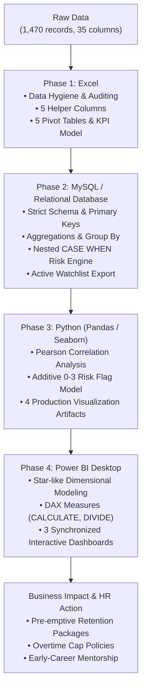

# 🏢 HR Attrition & Workforce Intelligence: Predictive Risk Segmentation

[](https://github.com/rohan912-456)
[](python/requirements.txt)
[](sql/)
[](LICENSE)

> **An enterprise-grade People Analytics case study analyzing 1,470 employee records across 35 attributes. Combines exploratory data analysis, relational SQL modeling, statistical correlation in Python, and an interactive 3-page Power BI dashboard to diagnose voluntary turnover drivers and operationalize a proactive retention watch-list.**

---

## 📌 Executive Summary

Employee turnover poses severe organizational costs, productivity losses, and talent acquisition strain. This project investigates voluntary attrition patterns within an enterprise workforce to answer three critical business questions:
1. **Who is leaving?** (Identifying demographic, tenure, and departmental clusters most prone to departure).
2. **Why are they leaving?** (Pinpointing actionable operational triggers: overtime demands, compensation equity, and satisfaction levels).
3. **Who is at risk next?** (Building explainable risk-scoring engines to provide HR business partners with a pre-emptive retention watchlist before resignation letters are submitted).

By implementing a multi-stage analytics pipeline across **Excel, MySQL, Python, and Power BI**, this project delivers both executive-level strategic visibility and individual-level tactical interventions.

---

## 🎯 Key Business Findings (The "TL;DR")

* **Baseline Turnover Benchmark:** Company-wide attrition stands at **16.1%** (237 departures out of 1,470 employees).
* **The Overtime Penalty (~3x Multiplier):** Employees subjected to mandatory overtime experience **30.5% attrition**, compared to only **10.4%** for non-overtime peers. Overtime is the single strongest operational catalyst for voluntary turnover.
* **Early-Tenure Vulnerability Window:** Turnover risk is heavily front-loaded in the **first 0 to 2 years at the company (~30% attrition)**, declining sharply to **~17%** for mid-tenure (3–5 years) and **~11%** for tenured staff (6+ years).
* **Severe Pay Discrepancy ($2,046 Gap):** Departing employees earn an average of **$4,787/month** versus **$6,833/month** for retained staff—representing a **~30% compensation shortfall** across comparable job levels.
* **Role-Specific Vulnerability:** **Sales Representatives (39.8%)** and **Laboratory Technicians (23.9%)** exhibit critical flight rates driven by the compound effect of low entry pay and high workload friction.
* **Predictive Risk Model Validation:** 
  * The SQL Rule-Based Model identifies a **High-Risk cohort departing at 36.6%** (~4.3x the Low-Risk baseline of 8.5%).
  * The Python 0–3 Flag Model scales monotonically from **5.7% (0 flags)** up to **59.0% (3 flags)**.

---

## 📊 Interactive Dashboard Walkthrough (Power BI)

The project includes an interactive, 3-page synchronized Power BI report (`power_bi/HR_Attrition_Visualization.pbix`) built with DAX measures, pre-attentive color semantics (Green = Retained/Low-Risk, Red = Leaver/High-Risk), and cross-filtering slicers.

### Page 1: Executive Overview


* **Purpose:** Provides C-Suite and VP-level stakeholders with top-line workforce health metrics.
* **Core Visualizations:**
  * **Top-Line KPI Cards:** Total Headcount (1,470), Total Leavers (237), Turnover Rate (16.1%), and Average Monthly Income ($6,503).
  * **Headcount vs. Attrition Rate Combo Chart:** Illustrates the inverse relationship between company tenure and flight risk (0–2 years spikes near 30%).
  * **Attrition Breakdown Donut:** Pre-attentive 83.9% active vs 16.1% departed split.
  * **Departmental Attrition Bar Chart:** Ranks departments by flight rate—Sales leads at 20.6%, followed by HR (19.0%) and R&D (13.8%).

---

### Page 2: Deep Dive: Who Is Leaving?


* **Purpose:** Enables HR Business Partners to pinpoint the exact intersections of compensation, role classification, and overtime demands.
* **Core Visualizations:**
  * **Income Band Attrition (%):** Low-income employees (<$3K/month) experience **28.6% turnover**, dropping to 15.0% ($7K–$12K), 12.0% ($3K–$7K), and only 5.6% for very high earners ($12K+).
  * **Role-Based Performance Matrix:** Ranks roles by departure rate, headcount, and average tenure of departing personnel (highlighting Sales Reps at 39.8% with average leaver tenure of just 2.1 years).
  * **100% Stacked OverTime Chart:** Visually isolates the disproportionate departure volume within the overtime-exposed population.
  * **Multi-Attribute Slicers:** Dynamic drill-downs by Department, Gender, OverTime, and Marital Status.

---

### Page 3: Risk Segmentation & Actionable Watch-List


* **Purpose:** Transforms retrospective analysis into prospective, preventative operational retention workflows.
* **Core Visualizations:**
  * **Active High-Risk Gauge Chart:** Isolates **153 currently active employees** flagged by the dual-criteria risk engine (OverTime = 'Yes' + JobSatisfaction ≤ 2).
  * **0–3 Flag Model Validation Chart:** Demonstrates statistical power as turnover probabilities climb from 5.74% (0 flags) ➔ 14.79% (1 flag) ➔ 32.21% (2 flags) ➔ 58.97% (3 flags).
  * **Rule-Based Segmentation Summary:** High Risk (36.6%), Medium Risk (18.7%), Low Risk (8.5%).
  * **Actionable Watch-List Table:** Detailed operational roster listing Employee Number, Department, Role, Age, Income, Tenure, and specific risk drivers for immediate management 1-on-1s.

---

## 🔬 Statistical Modeling & Python Visualizations

The Jupyter Notebook ([`python/HR_Attrition_Employee_Data_Analyst_Project.ipynb`](python/HR_Attrition_Employee_Data_Analyst_Project.ipynb)) executes end-to-end data hygiene, computes the full correlation matrix, and validates the 0–3 point scoring system.

| 01. Turnover vs. Tenure & Income | 02. Role-Level Attrition Rates |
| :---: | :---: |
|  |  |
| *Clear concentration of leavers in low-salary, low-tenure quadrant.* | *Sales Reps & Lab Techs exceed the 16.1% company benchmark.* |

| 03. Pearson Correlation Heatmap | 04. Risk Score Validation Curve |
| :---: | :---: |
|  |  |
| *Evaluates 24 numeric features against voluntary termination.* | *Monotonic progression validates predictive power of additive flags.* |

---

## 🛠️ Project Architecture & Analytics Lifecycle



### 1. Excel (Exploratory Data Analysis & Hygiene)
* **Completeness Auditing:** Verified zero missing values across all 35 columns using `COUNTBLANK`; confirmed uniqueness of `EmployeeNumber`.
* **Feature Engineering:** Created 5 helper columns:
  * `Attrition_Flag`: `=IF(H2="Yes", 1, 0)`
  * `Age_Group`: Nested `IF` bucketizing into `<30`, `30-39`, `40-49`, `50+`.
  * `Tenure_Group`: Segmented into `0-2 yrs (High Risk)`, `3-5 yrs`, `6+ yrs`.
  * `Income_Band`: Segmented into `<3K (Low)`, `3K-7K (Mid)`, `7K-12K (High)`, `12K+ (Very High)`.
  * `High_Risk_Flag`: Multi-condition logical flag combining overtime and satisfaction.
* **Summarization:** Built 5 interactive pivot tables and an executive KPI scorecard.

### 2. SQL / MySQL (Database Design & Segmentation)
* **Schema Design ([`01_schema_setup.sql`](sql/01_schema_setup.sql)):** Implemented strict data typing, `PRIMARY KEY (EmployeeNumber)`, and analytical indexes on `(Attrition)`, `(Department, JobRole)`, and `(OverTime)`.
* **Analytical Aggregations ([`02_analytical_queries.sql`](sql/02_analytical_queries.sql)):** Wrote performant queries measuring attrition across departments, roles, overtime exposure, and compensation bands.
* **Risk Engine & Watchlist ([`03_risk_segmentation_watchlist.sql`](sql/03_risk_segmentation_watchlist.sql)):**
  ```sql
  -- Multi-tier rule-based classification
  SELECT 
      CASE 
          WHEN OverTime = 'Yes' AND JobSatisfaction <= 2 THEN 'High Risk'
          WHEN OverTime = 'Yes' OR JobSatisfaction <= 2 THEN 'Medium Risk'
          ELSE 'Low Risk'
      END AS Risk_Segment,
      COUNT(*) AS Employee_Count,
      SUM(CASE WHEN Attrition = 'Yes' THEN 1 ELSE 0 END) AS Actually_Left,
      ROUND(SUM(CASE WHEN Attrition = 'Yes' THEN 1.0 ELSE 0.0 END) / COUNT(*) * 100, 2) AS Attrition_Rate_Percent
  FROM employee_attrition
  GROUP BY Risk_Segment;
  ```

### 3. Python (Statistical Validation & Modeling)
* Executed in [`python/HR_Attrition_Employee_Data_Analyst_Project.ipynb`](python/HR_Attrition_Employee_Data_Analyst_Project.ipynb).
* Evaluated full Pearson correlation matrix across 24 numeric features.
* Engineered an explainable additive Risk Scoring algorithm:
  $$\text{Risk Score} = \mathbb{I}(\text{OverTime} = \text{'Yes'}) + \mathbb{I}(\text{JobSatisfaction} \le 2) + \mathbb{I}(\text{YearsAtCompany} \le 2)$$
* Validated that observed turnover climbs monotonically: **Score 0 (5.7%) ➔ Score 1 (14.8%) ➔ Score 2 (32.2%) ➔ Score 3 (59.0%)**.

### 4. Power BI (Business Intelligence & DAX)
* Created DAX measures for clean ratio calculations and context transition:
  ```dax
  Attrition Rate % = 
  DIVIDE(
      CALCULATE(COUNTROWS('employee_attrition'), 'employee_attrition'[Attrition] = "Yes"),
      COUNTROWS('employee_attrition'),
      0
  )
  ```
  ```dax
  Active Employees = 
  CALCULATE(
      COUNTROWS('employee_attrition'), 
      'employee_attrition'[Attrition] = "No"
  )
  ```
* Integrated dynamic color conditioning, synchronized slicers, and custom tooltips.

---

## 💡 Strategic Recommendations for HR Leadership

| Strategic Pillar | Identified Root Cause | Proposed HR Intervention | Expected Business ROI |
| :--- | :--- | :--- | :--- |
| **1. Overtime Cap Policy** | Overtime staff leave at 30.5% (~3x normal rate). | Establish mandatory quarterly caps on consecutive overtime hours; implement flex-time recovery days and workload rebalancing. | Projected **15–20% reduction** in overtime-driven turnover, saving ~$350K+ in re-hiring costs. |
| **2. Early-Tenure Onboarding (0–2 Yrs)** | High turnover spike within the first 24 months (~30%). | Introduce a structured 30-60-90 day check-in schedule, assigned senior peer mentors, and 6-month career roadmap alignment. | Accelerate time-to-productivity and reduce first-year attrition by an estimated **8–12%**. |
| **3. Compensation Equity Audits** | Leavers earn an average of $2,046 less per month across identical job tiers. | Conduct bi-annual market salary benchmarks for bottom-quartile earners (<$3,000/mo), specifically in Sales and Lab roles. | Closes the wage gap for high-performing flight risks before they test the external market. |
| **4. Watch-List Intervention Protocol** | 153 active employees identified in the high-risk flight zone. | HR Business Partners conduct proactive, confidential "Stay Interviews" focusing on workload, growth, and team friction. | Retains critical institutional knowledge and preempts sudden operational disruptions. |

---

## 📁 Repository Directory Structure

```text
HR-Attrition-Workforce-Intelligence/
│
├── README.md                          <-- Executive case study & business report
├── LICENSE                            <-- MIT License
├── .gitignore                         <-- Ignores temp Excel (~$*), Python cache, OS files
│
├── assets/                            <-- Visual assets rendered in README
│   ├── dashboards/
│   │   ├── page1_executive_overview.png
│   │   ├── page2_deep_dive.png
│   │   └── page3_risk_watchlist.png
│   └── python_visuals/
│       ├── 01_attrition_overview.png
│       ├── 02_jobrole_satisfaction.png
│       ├── 03_correlation_heatmap.png
│       └── 04_risk_score_validation.png
│
├── data/
│   ├── raw/
│   │   └── HR-Employee-Attrition.csv  <-- Original raw dataset (1,470 records)
│   └── processed/
│       ├── dept_attrition.csv         <-- Departmental summary
│       ├── overtime_attrition.csv     <-- Overtime breakdown
│       ├── jobrole_attrition.csv      <-- Role-level matrix
│       ├── risk_segments.csv          <-- SQL risk segmentation results
│       ├── dept_gender_attrition.csv  <-- Cross-demographic metrics
│       ├── risk_score_validation.csv  <-- Python score validation
│       └── watchlist_employees.csv    <-- 23 high-priority active intervention cases
│
├── excel/
│   └── HR_Attrition_Analysis.xlsx     <-- Excel workbook with formulas & pivot tables
│
├── sql/
│   ├── 01_schema_setup.sql            <-- Database creation & table schema (CREATE TABLE)
│   ├── 02_analytical_queries.sql      <-- Core analytical queries (GROUP BY, aggregates)
│   └── 03_risk_segmentation_watchlist.sql <-- Nested CASE WHEN & active watchlist
│
├── python/
│   ├── HR_Attrition_Employee_Data_Analyst_Project.ipynb <-- Comprehensive EDA & risk scoring notebook
│   └── requirements.txt               <-- Python environment dependencies
│
└── power_bi/
    └── HR_Attrition_Visualization.pbix <-- Interactive 3-page Power BI dashboard
```

---

## 🚀 How to Run & Reproduce

### 1. Clone the Repository
```bash
git clone https://github.com/rohan912-456/HR-Attrition-Workforce-Intelligence.git
cd HR-Attrition-Workforce-Intelligence
```

### 2. Set Up the Relational Database (MySQL)
```bash
# Open MySQL terminal or phpMyAdmin
mysql -u root -p < sql/01_schema_setup.sql
mysql -u root -p < sql/02_analytical_queries.sql
mysql -u root -p < sql/03_risk_segmentation_watchlist.sql
```

### 3. Run the Python Analytics Pipeline
```bash
# Create and activate virtual environment (optional)
python -m venv venv
source venv/bin/activate  # On Windows: venv\Scripts\activate

# Install dependencies
pip install -r python/requirements.txt

# Launch and run the analysis notebook
jupyter notebook python/HR_Attrition_Employee_Data_Analyst_Project.ipynb
```

### 4. Explore the Power BI Dashboard
* Open `power_bi/HR_Attrition_Visualization.pbix` in [Power BI Desktop](https://powerbi.microsoft.com/).
* Verify data relationships and interact with the 3 report pages using synchronized slicers.

---

## 👤 Author & Contact

**Rohan Nandanwar**  
*Data Analyst | Business Intelligence & Analytics Specialist*

* **LinkedIn:** [linkedin.com/in/rohan4560](https://www.linkedin.com/in/rohan4560/)
* **GitHub:** [github.com/rohan912-456](https://github.com/rohan912-456)
* **Email:** [rohnandanwar456@gmail.com](mailto:rohnandanwar456@gmail.com)
